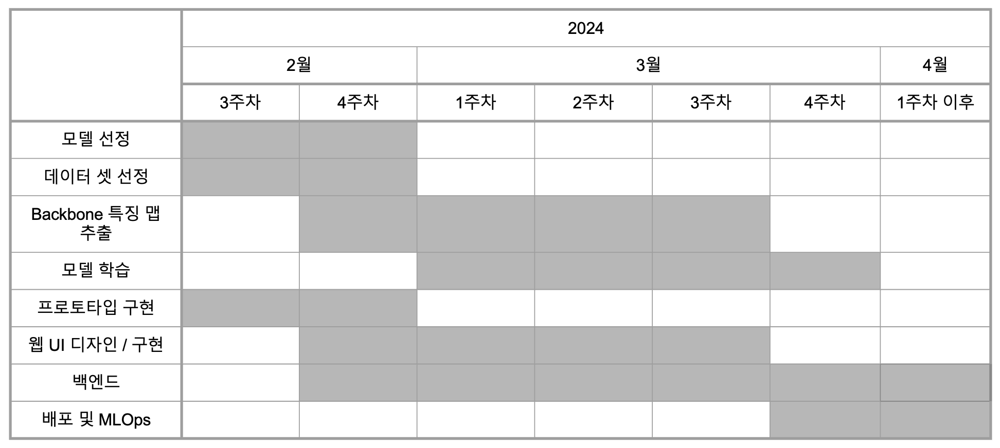
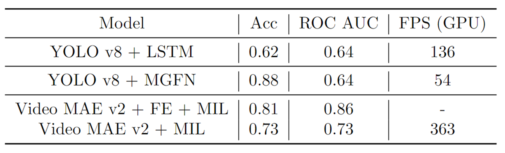

# 실시간 무인매장 이상행동 탐지

## 프로젝트 개요

웹으로 비디오, 실시간(CCTV, 유튜브) 영상을 받아 무인 매장에서 발생할 수 있는 다양한 이상 상황을 분석하고 해당 장면과 시간뿐만 아니라 이메일을 통해 알람을 제공하는 서비스입니다.

## 팀 구성 및 역할

| 이 름 | 역 할 |
| ----- | ----- |
| 김시웅 | 데이터셋 구성 및 코드 작성, 데이터 전처리(백본 feature 추출), VMAE 계열 모델 구현 |
| 박정민 | 데이터 탐색, FastAPI 기반 백엔드 기능 구현, 배포 |
| 백광현 | 프로젝트 기획 / 서비스 아키텍처 설계, API 구현 및 실시간 개발, LSTM-AE 모델링 / 학습 및 추론, 웹 서버 / 모델서버 분리, 배포 |
| 이동형 | AI 모델 학습, 웹 개발, 테스트 및 버그 수정 |
| 조형서 | 웹 개발, 모델 조사 |
| 최수진 | 모델링, 데이터 전처리, YOLO 계열 모델 구현 |

## 개발 타임라인

    

## 문제 정의

무인 점포가 증가하면서 **범죄 발생률도 같이 증가**하고, **심야, 주말** 등 관리가 소홀할 때 많은 범죄가 발생.

    
    
    

⇒ CCTV 를 활용하여 이상행동을 자동으로 탐지하고 증거확보 및 실시간 알람을 준다면 이 문제를 해소할 수 있지 않을까?

## 해결 방안

#### 서비스 측면

- 녹화된 영상을 직접 돌려보는 **시간과 비용 발생**
    ⇒ 업로드 영상을 분석 후 **타임 스탬프와 스크린 샷** 제공
    
- CCTV가 있더라도 관리자가 24시간 확인할 수 없어 **현장을 놓치는 문제** 발생    
    ⇒ **실시간 영상 분석**을 통해 **타임 스탬프, 스크린 샷** 그리고 **알람** 기능을 제공
    

#### 모델 측면

- **대용량, 장시간** CCTV 데이터를 사람보다 빠르게 처리하도록 속도 개선
- 무인 매장에서 발생할 수 있는 **다양한 상황**들을 잘 감지할 수 있도록 개선
- 이상 상황은 정확하게 판단하면서 **오탐률을 낮추는 방향**으로 개선

## Data

### **AI Hub 실내(편의점, 매장) 사람 [이상](https://www.aihub.or.kr/aihubdata/data/view.do?currMenu=115&topMenu=100&aihubDataSe=data&dataSetSn=71550) / [정상](https://www.aihub.or.kr/aihubdata/data/view.do?currMenu=115&topMenu=100&aihubDataSe=data&dataSetSn=71549) 행동 데이터**

- 특징
    - 이상 상황 여부를 프레임 단위 라벨링
    - 객체 바운딩 박스 + 포즈 스켈레톤 키포인트 라벨링 제공

- 카테고리
    - 구매 행동 : 매장 이동, 구매, 반품, 비교 등
    - 이상 행동 : 파손, 방화, 흡연, 절도, 폭행 등

    
    

## Data Preprocessing

    

- 비디오 데이터는 이미지 데이터에 비해 매우 큰 용량    
    → 주어진 AI Stages V100 서버는 100 GB **용량 제한**이 있어 모델 전체 End-to-End 학습이 아닌 기학습 가중치를 사용한 백본 네트워크로 영상의 **Feature를 미리 계산**해 학습을 진행    
- Backbone 네트워크의 기학습된 가중치는 고정하고, 영상 Feature들을 미리 계산해 csv(YOLO v8), npy(Video MAE v2) 파일에 저장해 학습 데이터 용량을 `353 GB` → `2.42 GB` 로 줄여서 학습을 진행

## Model

#### 모델 선정 기준

Backbone Network : **Video Masked Auto Encoder v2**

- 일반적인 영상 이상 탐지 모델의 영상 Feature 추출에 사용되는 Backbone Network는 **I3D**

I3D 방식은 Optical Flow를 추가로 계산하기 때문에 실시간성 확보에 어려움이 있다고 판단

**Optical Flow 사용하지 않고** **Action Recognition** 분야에서 좋은 성능을 낸 Backbone Network 선정

**YOLO v8**

- 주어진 데이터 셋의 라벨링에서 객체별 **바운딩 박스**와 **포즈 스켈레톤 키포인트**를 제공하기 때문에 활용할 수 있는 모델을 선정

Classifier : [**LSTM Auto-Encoder](https://github.com/surya2003-real/anomaly-detection-and-object-tracking?tab=readme-ov-file), [MGFN](https://arxiv.org/abs/2211.15098), [Deep MIL Ranking](https://arxiv.org/abs/1801.04264), [BN-WVAD](https://arxiv.org/abs/2311.15367)**

- 영상 Feature를 정상 / 이상 영상으로 **이진 분류**하는 Classifier

⛔  데이터 셋이 프레임 단위로 정상 / 이상 여부를 제공해 지도 학습이 가능하지만

👉  장기적으로 **Continual Learning**과 **영상 Feature 관리**를 위해

👉  **비지도 학습** 또는 **비디오 단위 라벨링**을 활용한 **약한 지도 학습**이 가능한 구조를 사용

#### 모델 구조 (실험 내용)

1. **YOLO v8 + [LSTM autoencoder](https://github.com/surya2003-real/anomaly-detection-and-object-tracking?tab=readme-ov-file)**

    

- 데이터에서 제공하는 **포즈 스켈레톤** 정보를 활용하고자 함
    - Feature 추출 : **YOLO v8 Pose**
        - 프레임 별 사람을 탐지해 Bbox, Keypoints 출력
        - 입력 영상의 Feature 추출
- YOLO v8 (실시간 객체 탐지) + LSTM (시간적 특성 모델링) 역할로 구성
- Classifier : **LSTM AE**
    - 비지도 학습을 활용
    - **정상 행동만 학습**하고, **Encoder 입력**과 **Decoder 출력**의 차이를 줄이도록 학습
        - 학습 데이터와 다른 **이상 행동 입력이 주어지면**, 복원된 출력은 입력과 많은 차이가 발생
            
            → **MSE**로 계산된 **복원 오차**가 임계치를 넘게 되면 이상으로 판단
            
- 장점: **실시간 데이터 처리, 스켈레톤 기반 행동 인식** 가능
- 한계: 정상 영상이어도 학습 과정에서 배우지 않은 경우 이상으로 판단

2️. **YOLO v8 + [MGFN](https://arxiv.org/abs/2211.15098)**

    

- LSTM의 한계를 극복하고자
**MGFN**(Magnitude-Contrastive-Glance-and-Focus Network)을 활용
- **약한 지도 학습** 방식을 도입
    
    → 라벨이 **부정확, 불완전한 데이터**에서도 **학습이 가능**하도록 개선
    
- Classifier : **MGFN**
    - 약한 지도 학습 활용
    - **어텐션 메커니즘**
        - 비디오 내의 다양한 **시간적 및 공간적 특징**을 분석하기 위해 설계
        - 정상 / 이상 행동의 **차이**를 더 잘 포착
- 장점 : MGFN 사용으로 더 **정교한 Feature 추출** 및 **성능 향상, 빠른 추론 속도**
- 한계: 학습 과정에서 **높은 계산 비용**과 **많은 시간** 소요

---

3. **Video MAE v2 + [Deep MIL ranking model](https://arxiv.org/abs/1801.04264)**

    

- Optical Flow 사용하지 않는 **Video MAE v2** 선정
    - Feature 추출 : **Video MAE v2**
        - 영상을 16프레임으로 나눠 710 차원의 Feature Vector로 추출
- 비디오 단위 라벨링으로 **약한 지도 학습** 방식 적용 가능.
- Classifier : **Deep MIL Ranking**
    - UCF-Crime 데이터 셋의 베이스라인 모델
    - 영상을 여러 조각으로 나눠 **조각 별** **이상 예측 점수**를 출력
        - 정상 / 이상 영상을 1:1로 병행해 점수를 예측한 뒤
        이상 영상의 모든 조각 예측 점수 중 최대값이 
        정상 영상의 모든 조각 예측 점수 중 최대값보다 커지도록 학습
    - BN-WVAD의 **Feature Enhancer** 구조를 추가 적용한 실험도 진행
- 장점
    - 학습 시 이상 영상도 학습해 비지도 방식보다 **일반화 성능 향상**
- 한계 : 이상 영상 중 이상 행동 토막의 위치를 잘못 예측하는 등 **라벨링 노이즈 발생** 가능

4. **Video MAE v2 + [BN-WVAD](https://arxiv.org/abs/2311.15367)**

    

- UCF-Crime 데이터 셋 기준 SOTA 성능의 **BN-WVAD** 선정
    - ROC AUC = 0.8724
    - Deep MIL Ranking Model = 0.7541
- Classifier : **BN-WVAD**
    - Transformer 계열 **Feature enhancer**를 사용해 Video MAE v2가 추출한 Feature Vector의 품질을 향상
    - 영상의 각 조각의 **최종 예측 점수**는 
    해당 조각의 Anomaly Classifier 결과와 
    Feature Vector들의 Mahalanobis Distance 평균을 **곱한 결과**
        - 각 Layer의 Output Feature 벡터들을 
        배치 정규화 과정에서 구해진 특정 벡터의 평균과 **[Mahalanobis distance](https://en.wikipedia.org/wiki/Mahalanobis_distance)**로 거리 계산
- 장점
    - Deep MIL ranking model의 **라벨링 노이즈** 문제 **개선**
- 한계 : Triplet 계열 Loss를 사용해 **Batch Size**가 다른 모델에 비해 **매우 커야** 학습이 잘 진행됨

#### Metric

- **ROC AUC score**
    - 이상 탐지 모델은
    **탐지율(True Postive Rate)**도 중요하지만 **오탐율(False Postive Rate)** 또한 매우 중요
    - ⇒ Threshold 값에 따른 **오탐율, 탐지율 값**을 곡선으로 표현한 ROC Curve의 면적인  **ROC AUC**로 성능 평가
- **FPS**
    - 30 FPS 이상의 실시간 탐지를 위해 **1 프레임 당 처리 속도(FPS)**로 속도 평가

    

TP, FP 에 따른 ROC Curve

#### 실험 결과

- 실험 기록 및 관리는 WandB를 사용하였으며, ROC AUC, FPS 외에도 정확도, 정상 / 이상 영상 예측 스코어 평균, 예측 스코어 최대값 평균 등 다양한 결과 값들을 기록

    
    

- 최종 결과
    

        
    

    - ROC AUC 기준 가장 좋은 성능을 보인 VMAEv2+FE+MIL 구성은 실제 이상 행동을 배우기보다는 데이터셋의 이상행동 발생 프레임 위치의 패턴만을 배운 것을 발견하여 **최종 모델**로는 **VMAEv2+MIL** 구조를 채용

## 🌏 Service

<aside>
💡 서비스 아키텍처 & 서비스 파이프라인

</aside>

- **Web Server - Front**
    - BootStrap, HTML
    - 설계한 와이어 프레임 기반으로 페이지별 기능 구현
    - 웹캠 기능
    - 세션 토큰을 활용한 사용자 검증
    - 실시간 탐지 시 일정 시간에 따라 탐지된 프레임 자동 업데이트
- **Web Server - Back**
    - Fast API
    - 클라이언트와 효율적 통신을 위한 **RestAPI** 설계
    - 모델 서버의 **트래픽 최소화**를 위해 DB 저장 및 읽기, 영상 저장 작업은 **웹 서버에서 진행**
    - **Websocket**을 이용해 모델 서버에 **실시간 프레임 전달**
    - 웹캠, RTSP, Youtube 동영상 등 다양한 소스 처리 가능하도록 구현
    - SMTP 를 활용한 **이메일 알람** 로직 구현
- **Web Server - Database**
    - MySQL, S3
    - DB에 대해 쓰기 작업보다는 **읽기 작업이 많고**, 복잡한 쿼리가 없기 때문에 **속도와 안정성이 좋은 MySQL** 선정
    - SQLAlchemy 의 ORM 활용
    - **용량이 큰** 비디오, 프레임 이미지들을 위한 저장소로 **AWS S3** 선정. DB에는 S3 URL 을 적재하여 접근 가능하도록 함.
    - 모델 추론 **결과(bounding** **box, keypoints)를 저장**하여 이후 추가 기능 혹은 모델 학습에 사용할 수 있도록 함.
- **Model Server**
    - FastAPI, Pytorch
    - GPU 사용 서버
    - 녹화 영상의 경우, 추론 이후 **OpenCV** 와 **FFMPEG** 를 이용, 후처리(코덱 설정)하여 html 에서 송출 가능하도록 함
    - **실시간 추론 서버**와 **녹화영상 추론 서버**로 나누어 운영.
    - 추론 시 이상행동 프레임을 AWS S3 에 저장하고, DB frame 테이블을 갱신

 
서비스 아키텍처

    

 
서비스 파이프라인

    

## 🛎️ Product Serving

- AI Stages 서버는 도커 컨테이너 환경으로 **외부 접속 및 방화벽 설정** **불가**
    - VPN에서 외부 접속이 가능하도록 하는 **우회 경로 오픈**이 **금지**
    - 제공되는 .ovpn 파일과 **SSH 포트 포워딩**을 통해 **AWS EC2** 환경에서 배포를 시도했으나 VPN 관련 오류인지, SSH 오류인지 로그를 확인하기 어려웠습니다.
- 우선, API 엔드포인트를 활용하여 웹 -모델 서버를 분리한 상태로 서비스를 완성시켜 놓았고, 이후 로컬 혹은 AWS 환경에서 배포를 지속적으로 시도하고 있습니다.
- 추가로 로드밸런싱을 이용하여 서버의 부하를 더 줄이는 방안도 공부하고 있습니다.
- 우리 서비스는 실시간 영상 분석을 제공하고 있는데, 다른 네트워크에 위치한 웹 서버 - 모델 서버 간 통신이 “실시간” 구현에 있어 문제되는지 면밀히 검토할 예정입니다.

## 📸 실제 모습

<aside>
💯 업로드 영상 분석

</aside>

1. 이상행동으로 판단된 **장면들과 타임스탬프를 저장**하고, 해당 시간대로 이동해 쉽게 확인할 수 있도록 제공
2. 특정 장면을 자료로 사용하기 위해 **화질 개선 혹은 몽타주 생성** 등의 기능을 추가할 수 있음

    

<aside>
💯 실시간 분석 & 알람

</aside>

1. **웹캠**, **동영상 스트리밍** 또는 **외부 CCTV** 와 연결하여 **실시간 이상행동 분석** 실시
2. 이상 행동이 일정 시간 지속되면 가입된 이메일로 **발생 시간** 전송

    

<aside>
💯 앨범

</aside>

1. 분석 단위로 앨범 기능을 제공하여 관리에 용이하고 결과를 재사용할 수 있다.

    

